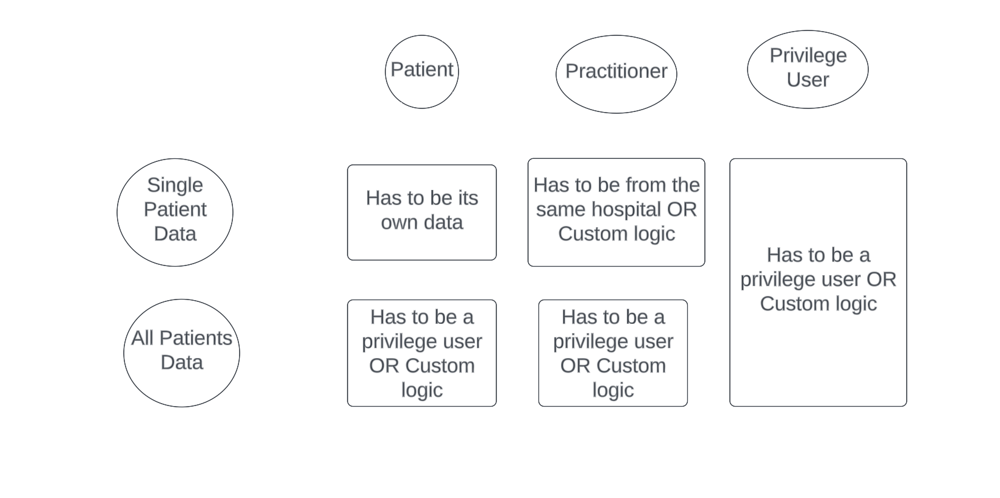

# module-ballerinax-health.fhir.authz

## authz.service

Authorization service for healthcare solutions, implemented in Ballerina.




### Claim Details

This implementation uses following claims sent through the id_token. 

| Claim Url                           | Description                                                            |
| ----------------------------------- | ---------------------------------------------------------------------- |
| http://wso2.org/claims/patient      | Represents the patient id of the authenticated user as a string.       |
| http://wso2.org/claims/practitioner | Represents the practitioner id of the authenticated user as a string.  |

### Extension Points

If you want to extend and customize the practitioner and privilege user authorization capabilities, you can implement following function types;

```bal
// Implement this function type if you want to customize the default authorization logic for practitioners.
type AuthorizePractitionersType isolated function (string patientId, string practitionerId) returns AuthzResponse;

// Implement this function type if you want to customize the default authorization logic for privileged users.
type AuthorizePrivilegeUsersType isolated function (AuthzRequest & readonly authzRequest) returns AuthzResponse;

```

### More Information

Please refer to the test cases at `authz.service/tests/service_test.bal` for more information.
