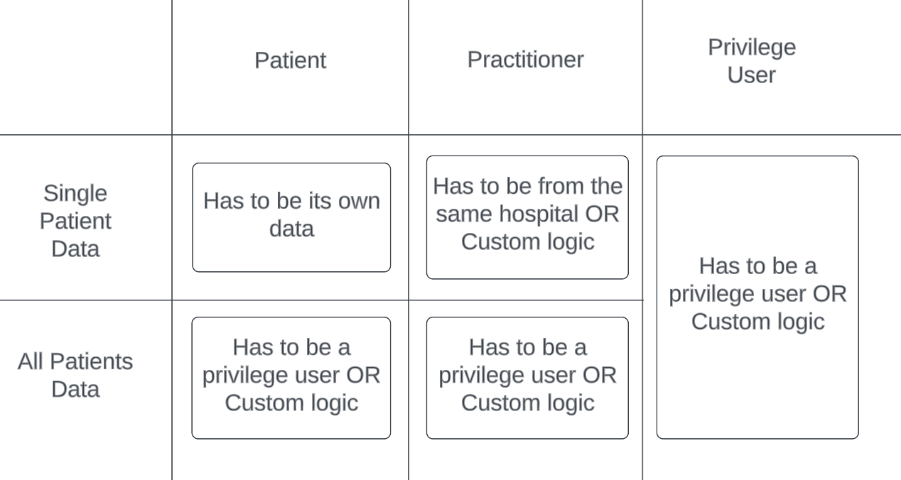

# module-ballerinax-health.fhir.authz

Authorization service for healthcare implemented in Ballerina.

## Claim Details

This implementation uses following claims sent through the id_token. 

| Claim Url                           | Description                                                            |
| ----------------------------------- | ---------------------------------------------------------------------- |
| http://wso2.org/claims/patient      | Represents the patient id of the authenticated user as a string.       |
| http://wso2.org/claims/practitioner | Represents the practitioner id of the authenticated user as a string.  |

## More Information

Please refer to the test cases at `authz.service/tests/service_test.bal` for more information.